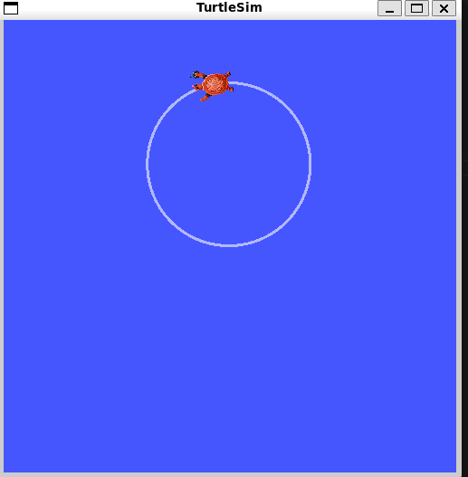

# make_CarWith_Ros
- 1. [Follow_for_ROS_installation](https://docs.ros.org/en/humble/Installation/Ubuntu-Install-Debs.html#environment-setup)
- 2. Now i stopped before <sudo apt install ros-humble-desktop>
- 3. making turtle moving <sudo apt install ros-humble-turtlesim>
- 4. echo "source /opt/ros/humble/setup.bash" >> ~/.bashrc
- 5. source ~/.bashrc
- 6. ros2 run turtlesim turtlesim_node (must run and keep window open)
- 7. write script run turtle
- 8. create new environment (remember ros 2 support only python3.10)
- 9. <conda create -n Ros_env python=3.10> , activate and run

